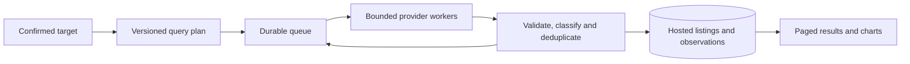

# Collecting hundreds to thousands of results per item

Design reviewed September 14, 2026. This is the next implementation plan, not a claim that these capabilities or inventory counts are already available. The current app is v0.5; its hosted database is now connected in the maintainer's setup, with authenticated save/reload validation awaiting application sign-in.

## Outcome

Build a collection for an item across sources and repeated observations. Show useful results early, keep collecting within an explicit budget, and let the user return to the same collection after closing the browser. Thousands of relevant offers are a possible outcome for common models across sizes and finishes, not a guaranteed minimum for every item. An exact season, color and size can have very little current inventory.

Keep four counts separate: raw candidates examined, unique marketplace offers, relevant offers, and offers matching the selected variant/size. Historical observations and potentially cross-listed offers need their own counts. More observations of the same shoe must not inflate the number available to buy.

## What limits this checkout today

| Area | Current behavior | Consequence |
| --- | --- | --- |
| Connected sources | Local status reports Poshmark enabled; eBay, Brave and image identification unconfigured | More marketplace buttons do not mean more connected inventories |
| Poshmark | One public page per request; follow its cursor to the keyword/recommendation boundary | The previously observed 199 GAT results belong to one query, not a global inventory ceiling |
| eBay | 30 offers/page, three pages per batch; one title query, US marketplace, fixed-price only | Small batches are an efficiency limit; US/query scope is a coverage limit |
| Brave | 20 hits/page, up to ten pages per query; two grouped queries in Legit or three in Reps | At most 400/600 raw indexed hits in the current plan before overlap, invalid URLs or irrelevant rows |
| Query planning | Only selected query variants run; target fields mostly affect ranking | Sellers using another model name, language or spelling may never be found |
| Long collection | Browser runs the Show all loop; continuation lives in tab memory | Closing the tab stops retrieval and loses its checkpoint |
| Persistence | Auto-save waits for collection to stop; later saves upload the accumulated collection again | Cloud configuration alone does not make collection durable; repeated small saves redo work |
| Rendering | Finder creates every result card; derived arrays and preview statistics revisit the whole collection | Thousands of cards and repeated full-array processing can slow the interface |

Implementation references: [provider adapters](../lib/discovery/providers.ts), [Poshmark](../lib/discovery/poshmark.ts), [continuation](../lib/discovery/pagination.ts), [Finder](../components/finder.tsx), [Library](../components/cloud-library.tsx), [save client](../lib/library/client.ts). Existing [pagination semantics](PAGINATION.md) remain applicable.

## 1. Expand searches while preserving item identity

Create a versioned query plan from the confirmed target. Run an initial page for each enabled source and high-confidence query before spending the remaining budget on deeper pages. Track the new relevant offers yielded by each query; favor useful queries while retaining some exploration of untried ones.

For the Margiela GAT example, the proposed seeds include:

| Scope | Example | Use |
| --- | --- | --- |
| Model | `Maison Margiela GAT`, `Margiela German Army Trainer` | Different seller descriptions of the same model family |
| Naming variation | `Maison Martin Margiela Replica sneakers`, `Margiela Replica low sneakers` | Legacy naming and the official Replica model name |
| Spelling | `Margella GAT`, `Margiela GATS` | Controlled spelling hypotheses; measure their unique yield |
| Item code | Confirmed full style code from the target or tag | Most precise query when available; never invent a code |
| Japanese | `メゾン マルジェラ レプリカ スニーカー` | A query hypothesis for Japanese sources, subject to relevance evaluation |
| Similar design | `German army trainer leather suede gum sole`, `德训鞋 真皮 麂皮 生胶底` | Separate Reps/alternative discovery, not proof of Margiela identity |

Do not require every descriptive word from a long title during initial retrieval. Collect the model broadly, then filter/rank by finish, size and condition. Keep a precise query alongside broader queries so exact matches are not buried. A user's strict size/variant constraint still governs the exact-match view.

The word **Replica** is also a Margiela model name: it cannot by itself classify an offer as counterfeit. Likewise, a seller explicitly describing a lookalike should not receive an exact branded-item label just because the title includes Margiela. Reps, independent alternatives, factory catalogs and resale claims need distinct classifications within their sections.

Use per-marketplace indexed queries instead of placing many domains into one shared query. Set the appropriate supported language/region parameters. Validate translated terms, retain the original query, and deduplicate equivalent seeds. Avoid an unbounded multiplication of every spelling, language, country and size.

## 2. Add inventory access in a useful order

1. **Validate eBay production access.** Raise its page size only after updating the cursor contract and fixtures; use up to 200 where supported. Add explicitly selected marketplaces and delivery eligibility. Keep currencies and auction bids separate. This is the clearest existing route to larger structured collections.
2. **Activate Brave discovery with appropriate storage rights.** Use it to find product URLs across Grailed, Depop, Vinted, Etsy, Mercari and other indexed sources. A search hit remains a candidate until permitted source observation provides price, availability and seller evidence.
3. **Extend Poshmark query coverage conservatively.** Keep serial requests and stop on access failures or recommendation boundaries. Its current public-page behavior is observed, not a stable contracted API or a promise of large-scale access.
4. **Evaluate Japanese retailer inventory and licensed feeds.** Rakuten Ichiba has an official product-search API. RAGTAG, 2nd STREET, Kindal and other relevant retailers are candidates for approved feeds/partnerships or supported access. Ichiba must not be presented as access to Rakuma or Japanese C2C listings.
5. **Treat remaining marketplaces individually.** Grailed, Depop, Vinted, Facebook Marketplace, Taobao, Weidian and 1688 need a supported access route before promising automatic coverage. Retain direct links when an adapter cannot access inventory. Buyee/ZenMarket are buying routes to underlying inventory, not extra independent copies of it.

Official limits checked for this design:

| Provider | Documented limit | Practical implication |
| --- | --- | --- |
| eBay Browse | Up to 200 results/page; up to 10,000 accessible items in a result set; offsets align to page size | If enough matching inventory is returned, 1,000 raw results need five full pages. Raising our page size improves efficiency, not inventory availability. [Pagination](https://www.ebay.co.jp/developer/api/browse_api/documentation), [result-set ceiling](https://developer.ebay.com/api-docs/buy/browse/release-notes-archive.html) |
| eBay quota | Default Browse allowance 5,000 calls/day, with method/account exceptions and production eligibility | Budget all requests against the actual account allowance. A larger result total does not override its accessible window. [Call limits](https://www.developer.ebay.com/develop/get-started/api-call-limits) |
| Brave Web Search | Maximum 20 results/page; offsets 0–9; pages may overlap or return fewer results | At most 200 raw hits per query. Use distinct relevant queries and sources; a search index is not an exhaustive inventory API. [API reference](https://api-dashboard.search.brave.com/api-reference/web/search/get) |
| Rakuten Ichiba | Up to 30 results/page and 100 pages; application ID and access key; excludes flea-market/C2C/auction inventory | Potentially 3,000 raw results for a sufficiently broad eligible query, not 3,000 Margiela resale offers. [Official API](https://webservice.rakuten.co.jp/documentation/ichiba-item-search) |

Category, price, condition or other documented filters can define meaningful subqueries when a broad API search reaches its window. Record their coverage and deduplicate their overlap; never imply partitioning defeats a quota or guarantees complete coverage. Prefer a licensed feed if ongoing bulk inventory access is the actual need.

For that later bulk route, evaluate eBay Feed only after checking the account's feed access. Its `PRODUCT_FEED` selects one offer per product/condition, so it cannot alone provide every seller's offer. Choose the permitted feed type for the coverage required. [Official Feed integration guide](https://developer.ebay.com/api-docs/buy/api-feed.html)

## 3. Move collection into durable cloud jobs

Use hosted PostgreSQL plus Supabase Queues as the initial design, keeping the existing Workers-compatible provider adapters behind a hosted consumer. The queue is durable storage, not a worker by itself: configure and test a hosted trigger/consumer that runs when the user's computer is off. Do not install a local database to satisfy this requirement.

A task processes one bounded page or small batch, then atomically commits accepted observations, counters and its next checkpoint before acknowledging the message. Queue delivery can be retried after a visibility timeout, so idempotent writes and lease/generation checks remain necessary. A crash between database commit and acknowledgement must not create duplicate records or skip a page. [Supabase Queues](https://supabase.com/docs/guides/queues), [PGMQ](https://supabase.com/docs/guides/queues/pgmq)

Do not run an entire collection in one detached HTTP request. Hosted functions have finite runtime limits; Supabase background tasks remain subject to them. [Background tasks](https://supabase.com/docs/guides/functions/background-tasks), [runtime limits](https://supabase.com/docs/guides/functions/limits)

Add explicit job/query records linked to the existing owner and saved search:

- Job: target revision, query-plan version, status, start/update times, stop reason, counters, provider budgets and cancellation generation.
- Query task: source, region, language, exact query/filters, source cursor, page size, attempts, next eligible time and worker lease.
- Accepted page: stable task/checkpoint identity, observation batch and processing outcome, so retry deduplication does not depend on a newly generated observation timestamp.
- Listing-to-target membership: preserve the query/source that found an offer while avoiding another full copy just because an alias matched it.

Persist only bounded validated cursors and approved normalized data. Keep provider credentials server-side and user JWTs out of queued payloads; the worker uses a restricted trusted path with explicit owner/job checks. Enqueuing requires authentication. Shared provider quotas must be reserved atomically across all workers, including retries and relevant authentication requests; existing per-process semaphores are insufficient.

Support queued, running, paused, rate-limited, completed, cancelled and failed states. Cancellation prevents further enqueueing; deleting a search invalidates outstanding work so a late worker cannot recreate it. One unavailable source must not halt healthy source tasks. Repeat cursors stop a task; repeated zero-new-result pages may pause that query with an explicit reason, without declaring global exhaustion.

## 4. Store unique offers efficiently and keep the interface fast

Keep current listing state separate from observation history as collection volume grows. Canonical identity is source + item ID + meaningful offer variation, scoped to the data owner initially. Connect one offer to multiple query matches. Preserve original URLs, evidence provenance, timestamps and scoring/matching versions.

Save each accepted page or changed observation once. Do not upload the entire growing collection after each page. Repeated imports are retries; later successful source observations are history. Cross-platform duplicates should first be flagged as candidates, not silently merged based only on a reused photo or seller display name.

The UI should request 50–100 rows at a time, with server-side filters/sorts and stable keyset pagination. Virtualize the Finder cards and lazy-load images. Avoid recalculating a hidden Library preview or serializing the entire session on every page. Existing Library pagination is a useful start; it does not solve Finder rendering or ingestion.

Start with PostgreSQL indexes and measured query plans. Add an indexed current-listing projection and full-text/trigram search if profiling justifies them; do not add another search service solely because a collection reaches 1,000 rows. Charts aggregate the full filtered collection rather than the visible page. Refresh chart summaries once per accepted batch/revision instead of once per row.

Storage capacity follows snapshot size and history depth, not just the current offer count. For example, an assumed 4 KB normalized observation × 10,000 offers × 30 observations is about 1.2 GB before indexes and other overhead. This is an illustrative estimate, not a measured snapshot size or plan quote. Measure actual bytes and define history retention before continuous collection. Keep photos as original URLs unless separately authorized image storage is needed.

## 5. Enrich the promising results first

Retrieve inexpensive search-card metadata broadly; prioritize detailed seller/item requests for the best matches and for offers the user opens. Cache/reuse permitted seller observations by stable source seller ID and expiry, without treating a display name as a permanent identity.

An unenriched offer remains visible with unknown seller evidence. A missing metric never becomes zero, and a low price alone does not establish fraud. Show exact variant, same model/different variant, related, conflicting and unverified counts. Keep fresh offers, stale/unknown availability, historical offers and factory minimum-order catalogs distinguishable. Shipping eligibility and delivered cost remain separate from an asking-price ranking.

## 6. Make coverage and cost visible

Show live counts for unique offers, selected-variant matches, duplicates, rejected candidates, unverified availability and completed/paused sources. Add request usage, last accepted page and stop reasons. Use **Continue collection** for a budget pause; do not call a budget-limited search complete or discard previously accepted rows.

Let the user choose sources, geographic scope, strictness and a request/cost budget. Start with a few high-confidence seeds, then expand according to marginal useful yield. More expensive enrichment gets its own budget. Do not count historical records or unrelated recommendations toward a requested result target.

Brave currently lists Search at $5 per 1,000 requests with monthly credits; 100 requests would be $0.50 before credits under that rate. Verify the actual account plan and storage entitlement before activating persistent discovery. Costs also include database/worker usage and other provider calls. [Brave pricing and storage-rights FAQ](https://brave.com/search/api/)

## Delivery order and acceptance checks

| Slice | Deliverable | Completion evidence |
| --- | --- | --- |
| A | Connect cloud Library and validate eBay/Brave account access and retention settings | Real save/reload plus permitted production searches; no setup failure presented as zero inventory |
| B | Versioned per-source query plan; larger eBay pages; Finder pagination; incremental page saves | Alias/style-code fixtures, compatible cursor validation, no repeated full-collection uploads, no truncation of accepted results |
| C | Durable jobs, shared quotas, hosted consumer, pause/resume/cancel and page checkpoints | Close browser/computer, reopen collection and see progress; worker restart/duplicate delivery preserves pages; deletion cannot resurrect records |
| D | Broader approved sources, region selection and selective enrichment | Measured unique relevant offers gained per source/request; evidence remains inspectable |
| E | Current-offer projection and larger-volume performance tuning | Reproducible 10,000-offer/100,000-observation benchmark, full-count charts/export, responsive UI and bounded queries |

Slices B and C can be developed with fixtures while cloud/provider access is pending. Hosted collection cannot be called delivered until its real consumer and persistence work with the user's computer off.

Evaluate relevance on common model searches (including GATs) and narrow variant searches (including the Rick Owens degrade jeans). Record unique relevant yield, exact-variant precision, duplicates, stale/unknown offers, first-result latency, total elapsed time, cost and query coverage. Synthetic 10,000-row tests prove capacity, not that 10,000 real matching offers exist. Maintain the roadmap's held-out relevance evaluation alongside capacity tests.
